# **Manual de Tecnico Fase 1 EDD** 
## **Introducción**
En este documento se describe los aspectos técnicos informáticos de la aplicación de escritorio, de manera que cualquier técnico informático pueda entender y comprender la lógica dentro del programa, para así poder darle mantenimiento y actualizarla si es necesario.

Dicha aplicación ha sido desarrollada por Pablo Javier Batz Contreras estudiante de Estructura de datos.

## **Objetivos**
Instruir al lector para el uso adecuado del código del programa, así mismo dar a conocer la lógica detrás del programa, de manera que se le facilite al lector la manipulación del código del programa.

Este programa fue realizado en c++, NetBeans.

## **Conocimientos Previos**
Los conocimientos que deberán tener las personas que manejen el programa son:
-   Manejo de IDE NetBeans
-	Conocimiento de estructuras listas, colas, pilas.
-	Logica de programación.
-	Conocimiento de lenguaje c++.

## **Requisitos del sistema**
- CPU, Intel Core 2 Duo 2 GHz recomendado
- RAM, 2 GB recomendado 
- Espacio en el disco duro, 30 mb
- Sistema Operativo windows 7,8,9.

### **Tipos de estrucutras** 
Se muestra la definicion del tipo de estructuras a utilizar.
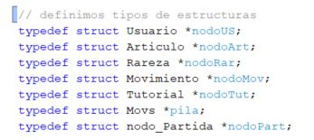

### **Variables Globales** 
En esta sección, se encuentran las variables que se han utilizado en las listas.
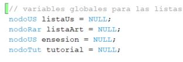

## **Menu apartura del juego** 
En esta sección, muestra la estructura del menu principal.
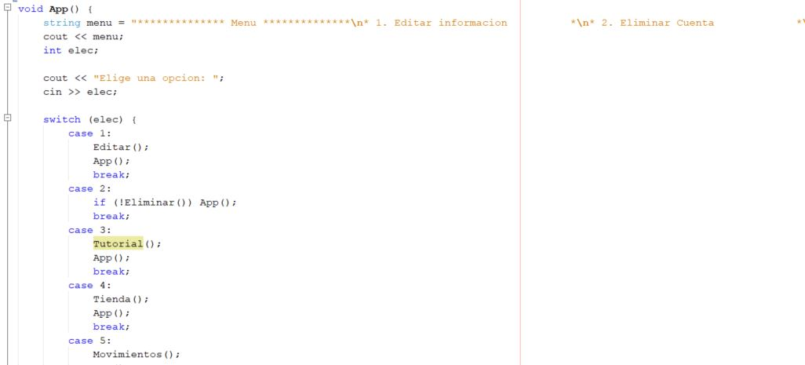

### **Nodo Usuarios** 
En esta sección, la creacion del nodo usuarios para utilziar en las listas.
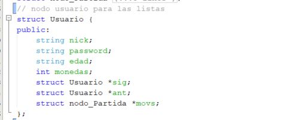

### **Lista para movimientos** 
En esta sección, se encuentran la lista crada para registrar los movimientos que realiza cada usuario 
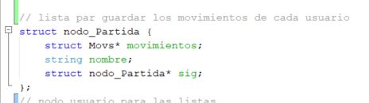

### **Nodo Articulo** 
Nodo articulo utilizado para genera las listas de los articulos
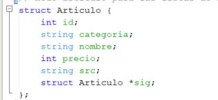

### **Metodos de Pila** 
En esta sección, se encuentran los metodos push and pop para insertar y eliminar datos en la pila.
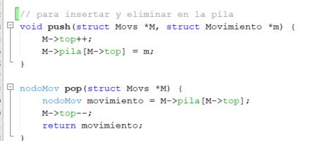

## **Nodo movimientos** 
Nodo utilizado para crear movimientos en las partidas.
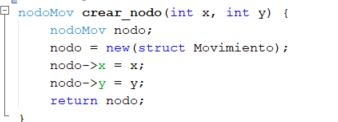

## **Articulos Lista con listas** 
Nodo creado para los artigulos que se generan en listas con listas.
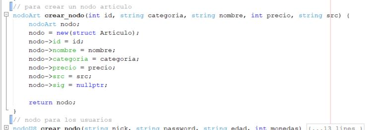

## **Crear nodo para usuarios** 
Nodo para crear los usuarios junto con los datos password, edad y monedas acumuladas.
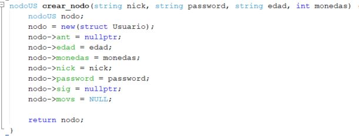

## **Metodos de la cola** 
Metodos para añadir y quitar elementos en la cola.
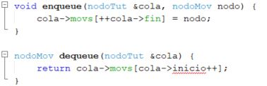

## **Metodos de lista Circular de Usuarios** 
Metodos para colocar primeros y utimos en las listas de usuarios.
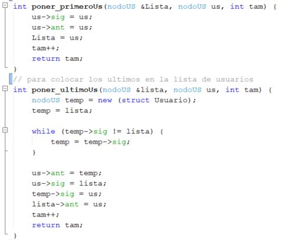

## **Metodos para editar usuarios** 
Metodos para añadir y quitar elementos en la cola.
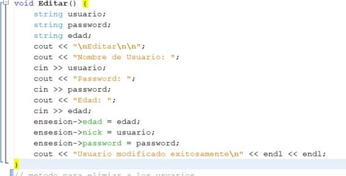

## **Metodos para eliminar usuarios** 
Metodos para añadir y quitar elementos en la cola.
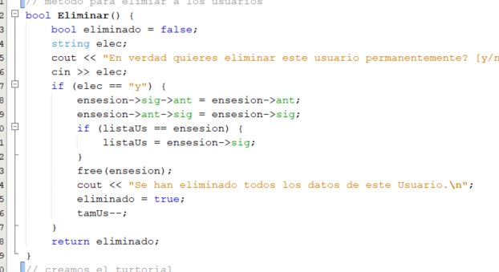

## **Metodos mostrar articulos** 
Metodo para mostrar articulos de la tienda y poder comprarlos.
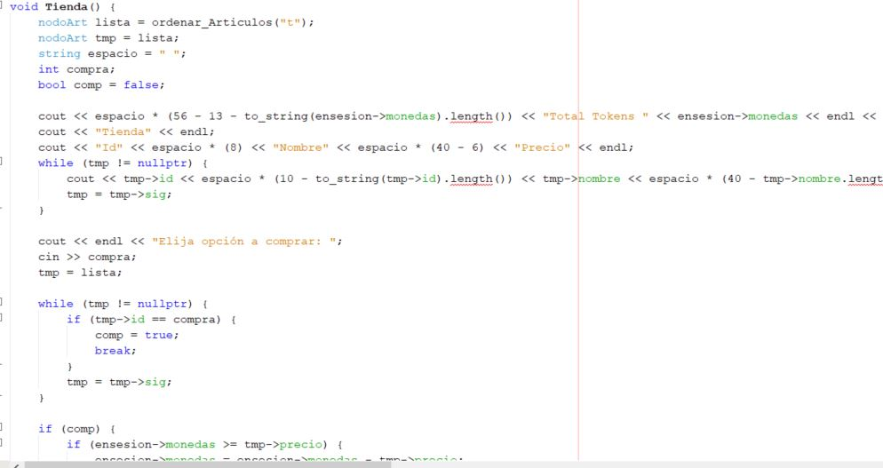

## **Metodos para realizar movimientos** 
Metodo para realizar y realizar movimientos segun los datos ingresados.
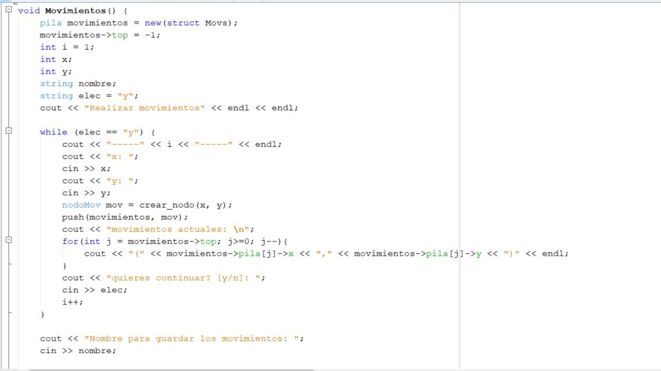